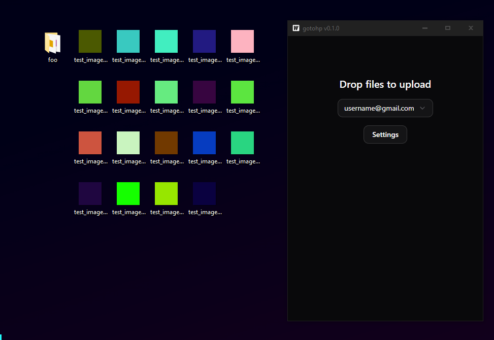

# gotohp



Unofficial Google Photos Desktop GUI Client

- Unlimited uploads (can be disabled)
- Drag-and-drop file upload interface
- Credential management
- Real-time upload progress tracking
- Configurable upload threads
- Individual files or directories uploads, with optional recursive scanning
- Skips files already present in your account
- Configurable, presistent upload settings (stored in "%homepath%/.config/gotohp")

## [Download](https://github.com/xob0t/gotohp/releases/latest)

## Requires mobile app credentials to work

You only need to do this once.

### Option 1 - ReVanced. No root required

1. Install Google Photos ReVanced on your android device/emulator.
    - Install GmsCore [https://github.com/ReVanced/GmsCore/releases](https://github.com/ReVanced/GmsCore/releases)
    - Install patched apk [https://github.com/j-hc/revanced-magisk-module/releases](https://github.com/j-hc/revanced-magisk-module/releases) or patch it yourself
2. Connect the device to your PC via ADB.
3. Open the terminal on your PC and execute

    Windows

    ```cmd
    adb logcat | FINDSTR "auth%2Fphotos.native"
    ```

    Linux/Mac

    ```shell
    adb logcat | grep "auth%2Fphotos.native"
    ```

4. If you are already using ReVanced - remove Google Account from GmsCore.
5. Open Google Photos ReVanced on your device and log into your account.
6. One or more identical GmsCore logs should appear in the terminal.
7. Copy text from `androidId=` to the end of the line from any log.
8. That's it! 🎉

### Option 2 - Official apk. Root required

<details>
  <summary><strong>Click to expand</strong></summary>

1. Get a rooted android device or an emulator. Recommended Android versions 9-13
2. Connect the device to your PC via ADB.
3. Install [HTTP Toolkit](https://httptoolkit.com)
4. In HTTP Toolkit, select Intercept - `Android Device via ADB`. Filter traffic with

    ```text
    contains(https://www.googleapis.com/auth/photos.native)
    ```

    Or if you have an older version of Google Photos, try

    ```text
    contains(www.googleapis.com%2Fauth%2Fplus.photos.readwrite)
    ```

5. Open Google Photos app and login with your account.
6. A single request should appear.  
   Copy request body as text.

#### Troubleshooting

- __No Auth Request Intercepted__  
  1. Log out of your Google account.
  2. Log in again.
  3. Try `Android App via Frida` interception method in HTTP Toolkit.

</details>

## Build

Follow official wails3 guide
[https://v3alpha.wails.io/getting-started/installation/](https://v3alpha.wails.io/getting-started/installation/)
