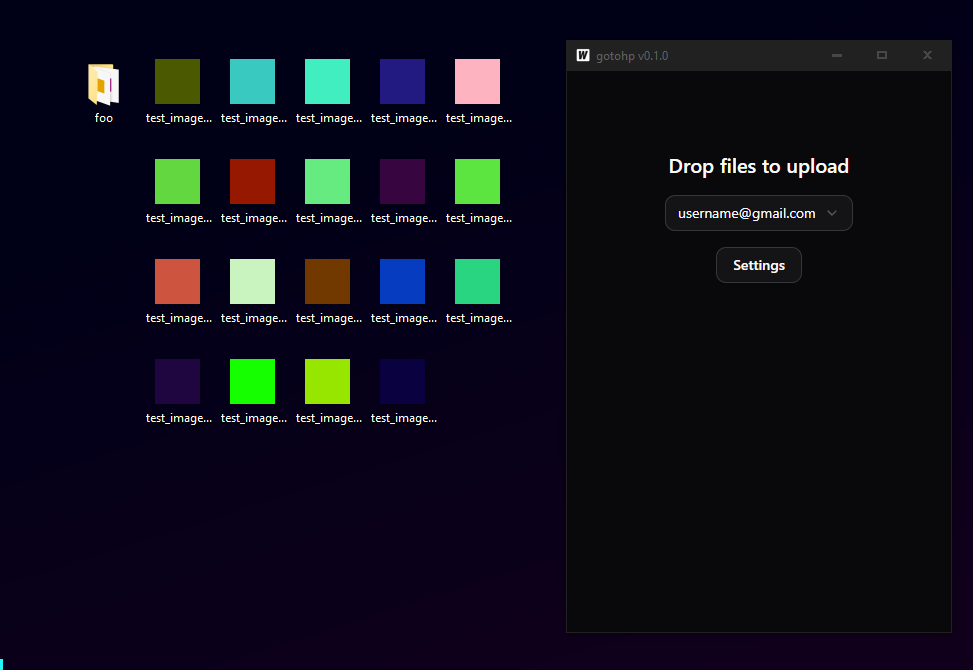

# gotohp



Unofficial Google Photos Desktop GUI Client

- Unlimited uploads (can be disabled)
- Drag-and-drop file upload interface
- Credential management
- Real-time upload progress tracking
- Configurable upload threads
- Individual files or directories uploads, with optional recursive scanning
- Skips files already present in your account
- CLI mode
- Configurable, presistent upload settings (stored in "%system config path%/gotohp/gotohp.config")  
   You can force local config by creating empty gotohp.config next to executable.

## [Download](https://github.com/xob0t/gotohp/releases/latest)

## CLI Usage

Releases include a standalone CLI executable for command-line usage. Use the `gotohp-cli` artifact for your platform; it does not depend on the GUI runtime.

```shell
gotohp-cli upload /path/to/photos --recursive --threads 5
gotohp-cli upload /path/to/photos --recursive --exclude @eaDir
gotohp-cli upload IMG_0001.HEIC IMG_0001.MOV --pair-live-photos
gotohp-cli upload IMG_0001.HEIC IMG_0001.MOV --pair-live-photos --update-existing-photos-to-live
gotohp-cli upload /path/to/export --recursive --pair-live-photos --ignore-apple-metadata
gotohp-cli creds list
gotohp-cli creds add "androidId=..."
gotohp-cli creds set user@gmail.com
gotohp-cli version
```

**Available commands:**

- `upload <path> [<path> ...]` - Upload one or more files or directories
  - `-r, --recursive` - Include subdirectories
  - `-t, --threads <n>` - Number of upload threads (default: 3)
  - `-f, --force` - Force upload even if file exists
  - `-d, --delete` - Delete from host after upload
  - `-df, --disable-filter` - Disable file type filtering
  - `--date-from-filename` - Set media date from filename (e.g. `20240709_182027.jpg`)
  - `--pair-live-photos` - Pair Apple Live Photo components; incomplete pairs are skipped by default
  - `--skip-incomplete-live-photos` - Skip metadata-confirmed Live Photo components whose match is absent
  - `--upload-incomplete-live-photos` - Upload unmatched Live Photo components as ordinary single files
  - `--update-existing-photos-to-live` - Upload and attach the matching MOV when the photo already exists; requires `--pair-live-photos`
  - `--ignore-apple-metadata` - Match pairs by case-insensitive filename stem instead of Apple content identifiers; requires `--pair-live-photos`
  - `-e, --exclude <pattern>` - Skip directories with this exact name during recursive upload (e.g. `@eaDir`)
  - `-a, --album <name>` - Add uploaded files to album (use `AUTO` for folder-based albums)
  - `-l, --log-level <level>` - Set log level: debug, info, warn, error (default: info)
  - `-c, --config <path>` - Path to config file
  - `--no-tui` - Disable the interactive progress UI (selected automatically when stdin or stdout is not a terminal)
- `creds list` (alias: `ls`) - List all credentials
- `creds add <auth-string>` - Add new credentials
- `creds remove <email>` (alias: `rm`) - Remove credentials
- `creds set <email>` (alias: `select`) - Set active credential (supports partial matching)
- `version` - Show version information
- `help` - Show help message

## Apple Live Photos

**Pair Apple Live Photos** is disabled by default. When enabled, gotohp matches
HEIC/JPEG and MOV components using their embedded Apple content identifier and
uploads each complete pair as one Google Photos item. Both local files must be in
the same upload queue. Filenames do not need to match in the normal mode.

**Update Existing Photos to Live** is a nested, default-off GUI option. Its CLI
equivalent is `--update-existing-photos-to-live`. If the byte-identical still
already exists in Google Photos, gotohp uploads only the matching local MOV and
attaches it to that existing photo. This operation still requires both local
components so gotohp can verify their Apple identifiers before using the still's
SHA-1 to find the correct remote item.

`--ignore-apple-metadata` is an advanced CLI-only override for exports whose
Apple identifiers are incorrect. It matches one still and one MOV with the same
case-insensitive filename stem in the same directory. The MOV must still contain
a valid Live Photo still-image-time marker. Ambiguous groups are skipped rather
than guessed. Google Photos does not enforce identifier equality for this private
upload path, so using the override with incorrectly named files can attach the
wrong video permanently.

Current limitations:

- A MOV by itself cannot locate its matching remote still; both local files are
  required.
- If only the MOV exists remotely, the pair is skipped because that reconciliation
  direction has not been recovered.
- gotohp cannot currently determine whether a remote photo is already Live.
  Repeating an update can upload and attach the MOV again.
- Existing standalone MOV items are not removed when a photo is updated.
- **Force Upload** remains a single-file option and does not bypass Live Photo
  pair decisions.

## Sign in

You only need to do this once.

### Option 1 - Embedded setup

1. Open gotohp and click **Add Google account**.
2. Click **Open Google sign-in** and sign in with the account you want to add.
3. Sign in on the Google Embedded Setup page and click **I agree**. The page may keep loading forever; this is expected.
4. Open the browser developer tools. Under Application or Storage, open Cookies for `accounts.google.com`.
5. Copy only the value of the `oauth_token` cookie and paste it into gotohp.
6. Click **Connect account**. gotohp exchanges the one-time cookie and does not save it.

### Option 2 - ReVanced. No root required

1. Install Google Photos ReVanced on your android device/emulator.
   - Install GmsCore [https://github.com/ReVanced/GmsCore/releases](https://github.com/ReVanced/GmsCore/releases)
   - Install patched apk [https://github.com/RookieEnough/Morphe-AutoBuilds/releases](https://github.com/RookieEnough/Morphe-AutoBuilds/releases) or patch it yourself
2. Connect the device to your PC via ADB.
3. Open the terminal on your PC and execute

   Windows

   ```cmd
   adb logcat | FINDSTR "auth%2Fphotos.native"
   ```

   Linux/Mac

   ```shell
   adb logcat | grep "auth%2Fphotos.native"
   ```

4. If you are already using ReVanced - remove Google Account from GmsCore.
5. Open Google Photos ReVanced on your device and log into your account.
6. One or more identical GmsCore logs should appear in the terminal.
7. Copy text from `androidId=` to the end of the line from any log.
8. That's it! 🎉

### Option 3 - Official apk. Root required

<details>
  <summary><strong>Click to expand</strong></summary>

1. Get a rooted android device or an emulator.
2. Connect the device to your PC via ADB.
3. Install [HTTP Toolkit](https://httptoolkit.com)
4. In HTTP Toolkit, select Intercept - `Android Device via ADB`. Filter traffic with

   ```text
   contains(https://www.googleapis.com/auth/photos.native)
   ```

   Or if you have an older version of Google Photos, try

   ```text
   contains(www.googleapis.com%2Fauth%2Fplus.photos.readwrite)
   ```

5. Open Google Photos app and login with your account.
6. A single request should appear.  
   Copy request body as text.
7. Add that credential string in gotohp.
8. If gotohp asks for a token binding key, keep the rooted device connected and click `Read from ADB`. gotohp will read the account's `lstBindingKeyAlias` from Android AccountManager and save it into the credential.

#### Troubleshooting

- **No Auth Request Intercepted**
  1. Log out of your Google account.
  2. Log in again.
  3. Try `Android App via Frida` interception method in HTTP Toolkit.
- **Token binding key not found**
  1. Make sure the same Google account is present on the connected device.
  2. Make sure root is available to ADB.

</details>

## Build

Follow official wails3 guide
[https://v3.wails.io/getting-started/installation/](https://v3.wails.io/getting-started/installation/)
